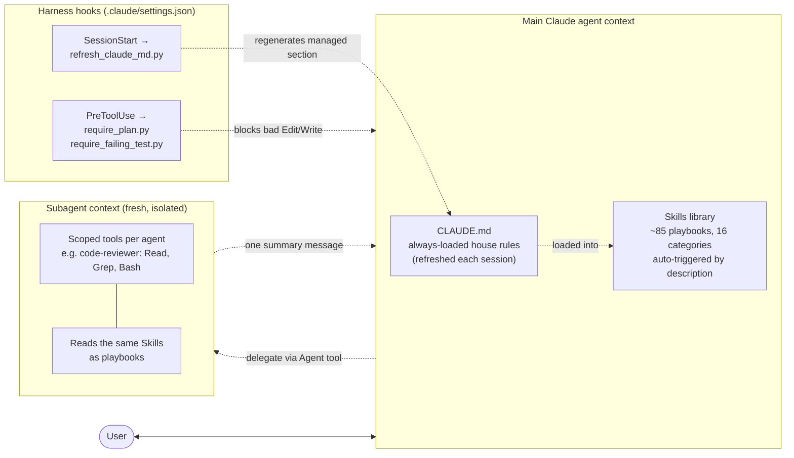

# ai-skills

A shareable library of Claude Code / Claude Enterprise **skills** and **subagents** that codify a consistent way of working across a team: PRDs, phased delivery, TDD, retros, ADRs, draw.io diagrams, OpenAPI-first APIs, structured `docs/` directories, plus a roster of specialist agents (code-reviewer, qa-engineer, architect, planner, prompt-evaluator, dependency-auditor, performance-investigator, incident-responder) that run with curated tool allowlists.

Designed so engineers, QA, and other AI agents all operate from the same playbook — and so a new project always starts with the same set of artifacts.

## What's in here

Skills are organized into sixteen categories:

| Category | What it covers |
| --- | --- |
| **planning** | Requirements clarification, assumption surfacing, PRD creation, story breakdown, retros, ADRs, estimation |
| **development** | TDD enforcement, phased implementation, PR descriptions, self-review |
| **documentation** | `docs/` directory structure, draw.io diagrams, OpenAPI/Swagger (MCP-ready), decision log, CHANGELOG, README, CLAUDE.md bootstrap |
| **quality** | QA test plans, bug investigation, test pyramid audits, coverage gaps |
| **operations** | Incident postmortems, deploy checklists, rollback plans |
| **collaboration** | Handoff prep, onboarding walkthroughs, context snapshots |
| **security** | Threat models, security reviews, dependency audits, secrets hygiene, auth coverage, PII handling, data retention, right-to-delete, audit log retention |
| **code-standards** | Style guide, error handling, logging, naming, typing strictness, linter config |
| **performance** | Perf budgets, performance investigations, load-test plans, query/index tuning, caching strategy |
| **architecture** | API design, resilience patterns, service boundaries, data modeling, twelve-factor checklist |
| **cicd** | Pipeline design, branch protection, artifact promotion, release strategy, environment parity, flaky-test management |
| **integration** | Service map, upstream-callers review, downstream-dependencies checklist, API contract evolution, contract tests |
| **dev-environment** | Dev-machine disk audit, Docker cleanup, git worktree cleanup, dependency cache cleanup |
| **ai-engineering** | Prompt engineering, LLM evals, cost management, hallucination guardrails, RAG, agents, LLM safety |
| **observability** | Metrics design (RED/USE), SLO definition, alerting policy, dashboards, distributed tracing, synthetic monitoring |
| **finops** | Cloud cost budgets, right-sizing, idle-resource audit, cost attribution |

Browse the full catalog in [INDEX.md](INDEX.md).

In addition to the skills, this repo ships **8 subagents** under [`agents/`](agents/README.md) — specialist roles (code-reviewer, qa-engineer, architect, planner, prompt-evaluator, dependency-auditor, performance-investigator, incident-responder) that the main agent can delegate to. Subagents differ from skills: they run in their own isolated context window with a curated tool allowlist, so they're the right shape for independent reviews, parallel audits, and write-scoped roles.

## How it fits together

Four moving parts: **CLAUDE.md** (always loaded), **skills** (description-triggered playbooks in the main thread), **subagents** (specialist roles in their own isolated context), and **hooks** (run by the harness on events). They compose like this:



**The reading order is:**

1. **CLAUDE.md** — loaded unconditionally each session. House rules apply to every turn. The managed section auto-refreshes from this library; the hand-written section stays put.
2. **Skills** — descriptions are visible to the main agent at session start; the relevant one fires when its description matches the request. Runs in the main thread.
3. **Subagents** — invoked via the `Agent` tool when isolation matters (independent review, parallel audit, write-scoped role). Each spawns with a fresh context window and a tool allowlist.
4. **Hooks** — invisible to Claude; the harness runs them on `SessionStart` and `PreToolUse` events. They're how "must" rules get enforced (CLAUDE.md is current, plan exists, test came first) rather than relying on the model to remember.

Canonical diagram: [`docs/architecture/library-overview.drawio`](docs/architecture/library-overview.drawio) — open in [draw.io](https://app.diagrams.net/) or any IDE plugin. The Mermaid above mirrors it for inline rendering.

## Installing

### Personal install (across all your projects)

```sh
git clone https://github.com/ryan-evans-git/ai-skills.git ~/code/ai-skills
~/code/ai-skills/install.sh
```

`install.sh` symlinks each skill into `~/.claude/skills/` AND each subagent into `~/.claude/agents/` so Claude picks them up everywhere.

### Project-scoped install (so QA, other devs, and CI agents pick them up automatically)

From inside a project repo:

```sh
git submodule add https://github.com/ryan-evans-git/ai-skills.git .claude/skills/ai-skills
```

Claude Code auto-loads skills from `.claude/skills/`. Anyone who clones the repo with `--recurse-submodules` gets the same skill set.

### Hooks

Three hooks ship with the library, all opt-in per project via `.claude/settings.json`:

- **`require_plan.py`** (PreToolUse) — blocks edits unless `docs/plans/CURRENT.md` exists and is recent.
- **`require_failing_test.py`** (PreToolUse) — blocks edits to production code without a recently-touched test.
- **`refresh_claude_md.py`** (SessionStart) — regenerates the managed section of `CLAUDE.md` each session so house rules stay current as the library evolves. Hand-written content outside the managed markers is preserved.

See [hooks/README.md](hooks/README.md) for wiring details.

## Conventions

Every project that uses this library is expected to grow this directory tree:

```
docs/
├── prds/             ← product requirement docs (one per feature/epic)
├── plans/            ← phase/story plans; CURRENT.md is the live one
│   └── CURRENT.md
├── decisions/        ← ADRs, numbered, one per file
├── retros/           ← end-of-phase retrospectives
├── progress/         ← session-by-session progress notes + handoffs
├── architecture/     ← draw.io diagrams + supporting notes
├── postmortems/      ← incident writeups
├── qa/               ← QA test plans
├── api/              ← OpenAPI / Swagger specs
├── security/         ← threat models, reviews, PII inventory, secrets/retention policy, audit-log spec
├── standards/        ← style guide, error handling, logging, naming, typing, linting
├── performance/      ← perf budgets, investigations, load tests, DB tuning writeups
├── architecture/     ← (extended) twelve-factor audit, caching strategy, system diagrams
├── cicd/             ← pipeline design, branch protection, release strategy, env-parity matrix
├── integration/      ← service map, API contract policy, contract tests
├── ai/               ← prompts, eval suites, cost management, RAG / agent / guardrail docs
├── observability/    ← metrics inventory, SLOs, alerts, dashboards, tracing, synthetics
└── finops/           ← budgets, right-sizing audits, idle-resource audits, cost attribution
```

The **docs-directory-keeper** skill knows this layout and will create / maintain it.

## Contributing a new skill

See [docs/contributing-skills.md](docs/contributing-skills.md).

## License

MIT — see [LICENSE](LICENSE).
